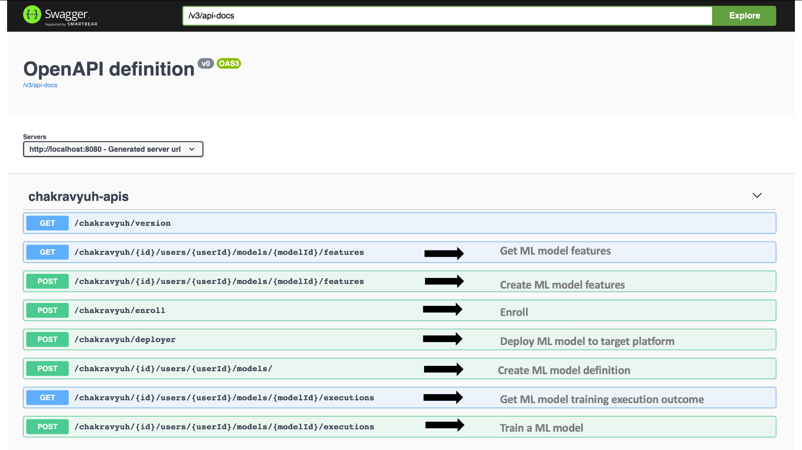
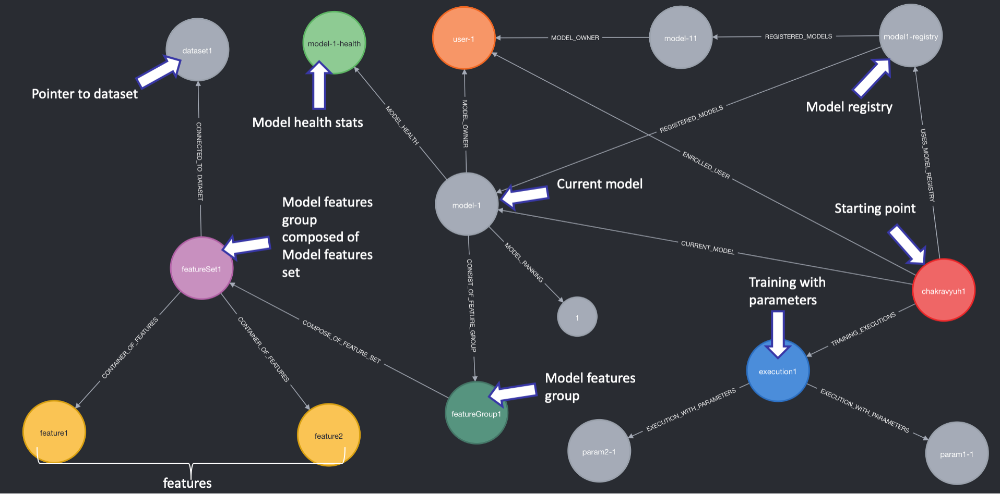

# Chakravyuh
Graph based ML engineering collaboration platform not opinionated about target platform on which ML engineering runs. Following are its key features:
* Features management
* Feature tracking & versioning
* Feature composing using group/set
* Dataset management
* Dataset tracking & versioning
* Model training & tracking with in built versioning support
* Hyper parameter tracking with in built versioning support
* Built on APIs first design paradigm
* Discover ML Model
* Rank ML Model
* Register a ML Model
* Attach ML model to user
* Pointer to where ML is stored
* Platform agnostic – sagemaker, kubeflow etc
* ..... ....

## Yet Another ML Framework
We have various platform but no collaboration framework. The business values are lost when we switch from one platform to another. How can I address this? Proposal  is: **_Chakravyuh_**. A platform like Sagemaker, Kubeflow etc are platform to execute ML engineering chores. The real value is in connecting these chores and understanding. When we talk about connecting, nothing beats **_Graph_**.The idea is to build *facebook* form ML Engineering. :-) In this context, ML model are user/friend and things like, features, model health stats, dataset etc are continuous ML knowledge stream. This platform should allow sharing of model (ranking) by model performance etc.

### What its not?
* Not a store of dataset
* Not a store feature values
* Not hyper parameter tuning framework
* Not a ML model store

### What it is?
* Composable features creation based on set theory – group/set
* Feature strongly typed to data frame/schema registry
* Pointer to data location (s3 etc)
* Record/Track execution based on hyper parameters
* Versioning management as first class citizen of design
* Generate OAS 3.0 specification from features (used by model serving layer)
* Extract feature from Data Frame via reactive REST API
* ....... ....

## Why name [Chakravyuh](http://mahabharata-research.com/military%20academy/the%20mysterious%20chakravyuha.html)?

The name comes from Indian mythological epic Mahabharata. In short, it means an **_Invincible_** circle. This project aim to make an invincible ML engineering circle of interpretation easy, like lineage tracking, feature management and more, while performing ML chores using the power of graph theory.

## Graph Domain Model
Following diagram shows the domain modelling:

## Chakravyuh REST APIS
Following pictures shows REST APIs. At broad level Chakravyuh supports following category of apis:
- ML engineering chores APIs
- ML engineering's collaborations APIs
- Deployment APIs

## How to Run?
Chakravyuh As Service is build using:
- Java 14
- Spring Boot 2.3.3
- Neo4j
- Spring data neo4j

Below are steps to run this service:
- Run neo4j docker
- Run the ChakravyuhApplication

## Output
The following output shows sample graph inferencing of a typical ML engineering run:

**NOTE** The starting of above graph is **chakravyuh1**

## Project Status

- [x] Domain model design
- [x] Data simulator, simulating ML processes end to end
- [X] Project setup and execution
- [X] Framework for features store/versioning
- [X] Framework for dataset versioning
- [X] Framework for hyper parameter management and versioning
- [ ] Detect circular cycle in model when modeling referring *features*
- [ ] Data frame to feature extraction
- [ ] Publishing OAS 3.0 schema to ease in model serving
- [ ] Pointer to Model Store
- [ ] Unit and integration tests
- [ ] Reactive APIs to feed metadata to Chakravyuh
- [ ] Dockerization & k8s
- [ ] IAC
### Reference Documentation
For further reference, please consider the following sections:

* [Official Apache Maven documentation](https://maven.apache.org/guides/index.html)
* [Spring Boot Maven Plugin Reference Guide](https://docs.spring.io/spring-boot/docs/2.3.3.RELEASE/maven-plugin/reference/html/)
* [Create an OCI image](https://docs.spring.io/spring-boot/docs/2.3.3.RELEASE/maven-plugin/reference/html/#build-image)
* [Spring Web](https://docs.spring.io/spring-boot/docs/2.3.3.RELEASE/reference/htmlsingle/#boot-features-developing-web-applications)
* [Spring Data Neo4j](https://spring.io/projects/spring-data-neo4j)

### Guides
The following guides illustrate how to use some features concretely:

* [Building a RESTful Web Service](https://spring.io/guides/gs/rest-service/)
* [Serving Web Content with Spring MVC](https://spring.io/guides/gs/serving-web-content/)
* [Building REST services with Spring](https://spring.io/guides/tutorials/bookmarks/)

